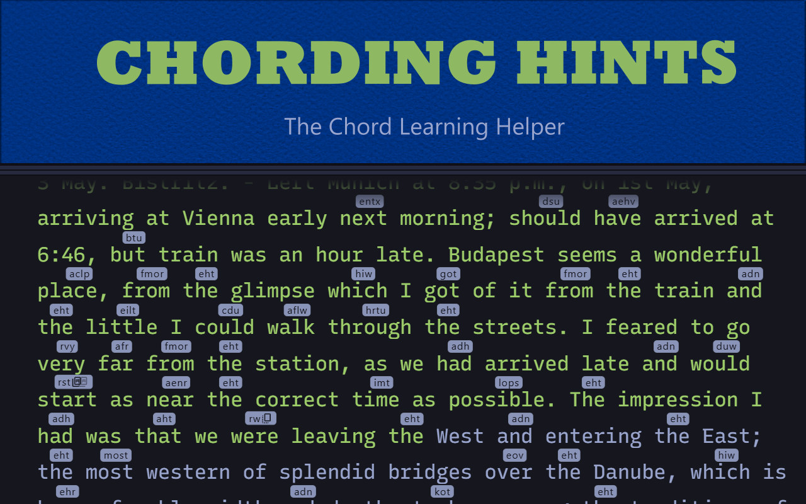
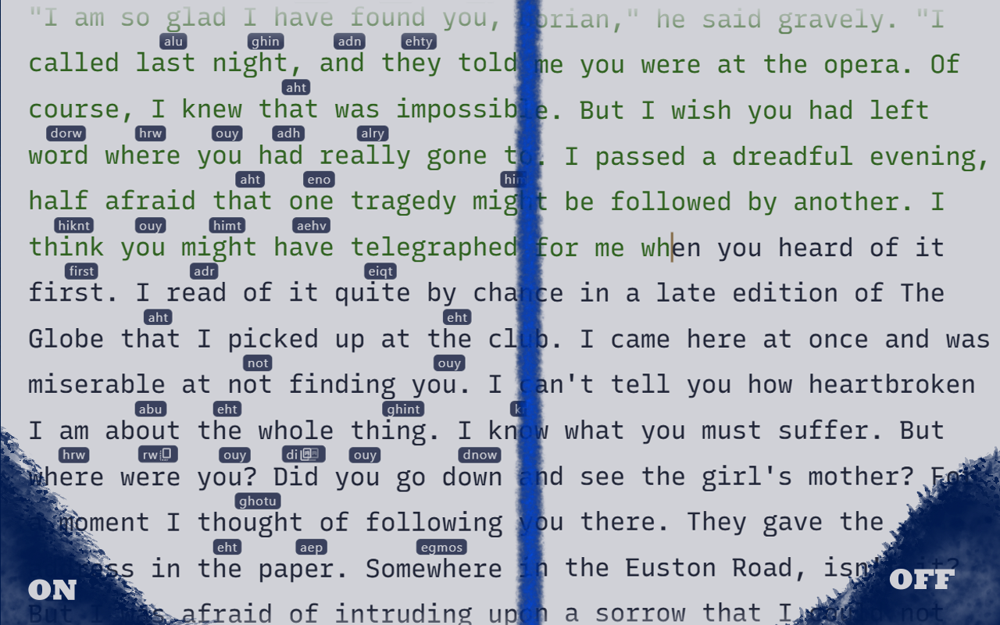

# Charachorder Chording Hints

Chrome extension that loads Charachorder chords to an internal library, either via serial connection to a CharaChorder device or JSON export, and shows matching chord hints above words. 

Currently works with:
- [Entertrained](https://www.entertrained.app)
- [MonkeyType](https://www.monkeytype.com)
- [Keybr (Practice mode only)](https://www.keybr.com)

Note that using this extension with Keybr places the cursor in a weird place at the beginning of each set, but it moves back to its normal place once you start typing. Details below. 

## Installation
Getting it from the [Chrome Web Store](https://chromewebstore.google.com/detail/chording-hints/kjonpbdnebghldijannjicojhkmebjmn) would be the easiest method for installation and ensuring the extension stays up-to-date.

That said, MonkeyType and Keybr support are still pending review for the web store version. 

You can also just download this repo (unzipping it if necessary, depending on how you downloaded it). After that:

1. Open any chromium browser and go to your manage extensions page.
2. Turn on Developer Mode.
3. Click on `Load Unpacked` and select the now-unzipped extension.
4. Aaaaand, that should be it.

## Setup
1. Go to the extension's Options Menu (either via right-click menu or by clicking on the extension icon and clicking on the Sync Chords/Options Menu button there)
2. Click on the Sync Chords button
3. You'll be prompted to select your CCOS device (ex. CharaChorder 2.1, MasterForge, CharaChorder Lite, etc). Find and select it from the list.
4. Wait for your chord library to load

## Usage
1. Go to any supported website
2. Start a typing session
3. See the chording hints!
4. If you don't see the hints, click on the extension icon in your toolbar and make sure it's on (the Power button should be green).

## Troubleshooting
### Unable to connect to CCOS device to load chord library
If, for whatever reason, you can't connect to your CCOS device:
1. Export your chord library to a JSON format (likely from [the CharaChorder.io site](https://master.dev.charachorder.io/config/chords/)
2. From this extension's Options page, find your JSON chord file via the `Choose File` button next to the `Import JSON` button
3. `Import JSON` and wait for your chords to load

## Known Issues and Limitations
- **No Affixes**: Currently only matches exact words only, so if you have the word "noun" in your chord library, but you don't have "nouns", and the word "nouns" shows up as a word in a training session, then you won't see a chord hint for it. Similarly, if you have "-tions" set up as a chordable-suffix but *not* as part of a compound chord, then this extension won't pick up on it. Compound chords work just fine, though.   
- **Keybr**: Keybr's normal spacing between lines is too small to easily accomodate chord hints, so by default, this extension adds a bit of space above each line. But due to some Keybr-side position calculations, this causes the typing cursor to start each section at the top of the first word instead of below it. It's not a big deal, but if you have any ideas about how to fix this, let me know. 

## Bug Reports, Suggestions, Feature Requests, Etc.
If you have any issues, you can let me know either by using the tools that GitHub provides or find me on the official CharaChorder Discord channel.

____

