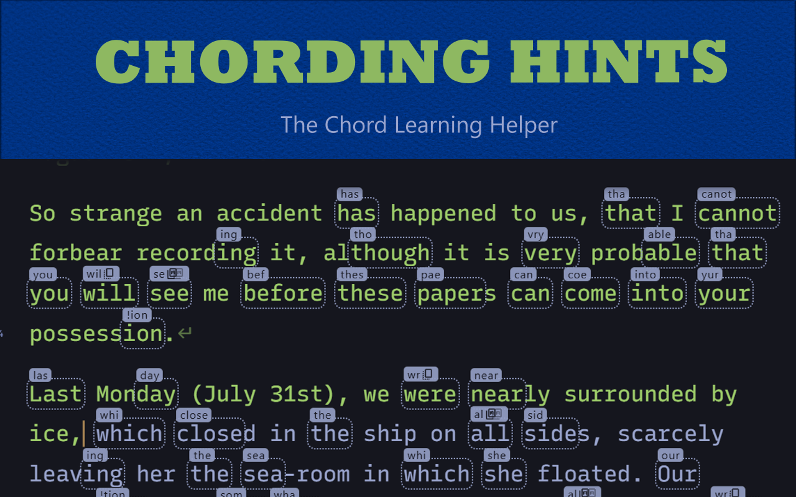
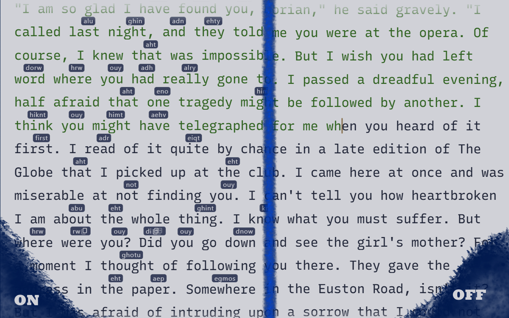

# Charachorder Chording Hints

Chrome extension that loads Charachorder chords to an internal library, either via serial connection to a CharaChorder device or JSON export, and shows matching chord hints above words. 

Currently works with:
- [Entertrained](https://www.entertrained.app)
- [MonkeyType](https://www.monkeytype.com)
- [Keybr (Practice mode only)](https://www.keybr.com)

Note that using this extension with Keybr places the cursor in a weird place at the beginning of each set, but it moves back to its normal place once you start typing. Details below. 

## Features
- Shows you which words you have chords for in a typing training session. You can choose to either show the exact chord input or to hide the input but still be reminded that the word is chordable.
- Shows every part of a word that's chordable with hints and outlines
  - Ex: If you run into the word "hippopotomonstrosesquippedaliophobia", but you don't have it in your chord library, but you ***do*** have "hippo" and "phobia", then you'll see hints for "hippo" and "phobia" anchored to the relevant parts of the word so you can chord "hippo", type out all the characters between that and "phobia", then chord "phobia".
  - Also useful for seeing that you can chord "great", then hit the "er" modifier to turn it into "greater". 
  - Outlines and non-whole word hints can be turned off if you find them distracting.

## Matching model (this fork)
Substring matching is delegated to
[`Tactile-Taco/chording-core`](https://github.com/Tactile-Taco/chording-core)
(Aho-Corasick matcher + cost-model resolver + Lean-verified decision core).
Gated mode only, no fallback:

- The options page **Full sync** reads the chord library (`CML`), the device
  settings consumed by the decision gates (`VAR B1`: 49 chording enable,
  62 concatenation style, 81 arpeggiates enable, 85 arpeggiates mode,
  112 layer warp), and the bound layout (`VAR B3`, profile A layers).
- An action expands the output space only if it is bound in the live
  layout or reachable via a bound chord output; chord inputs must be
  physically feasible (layer-dynamics F-gate). Settings modulate matching
  (concatenation style, arpeggiate/modifier compounding, warp).
- Without a device state nothing matches (fail closed). JSON import feeds
  only the options-page editor and export features — it produces no hints.

The preexisting exact-word path (dictionary lookup + naive modifier
suggestions) is removed entirely: every word goes through chording-core,
so exact words are matched by the same matcher/resolver as substrings.
Settings that only the exact path consumed (`selectionMode`,
`includeArpeggiates`, `includeModifierStyle`, `enableNaiveModifierHints`)
are gone from the options page.

### Data-gated heuristics
Anything that should be heuristically guided is data gated for
implementation: heuristics that price how chords are *actually* typed
(e.g. internal-word chords followed by a backspace when the chord appends
a trailing space, or symbolic `+`/`->` hint annotations for modifiers and
pre/post actions) need real typing-speed data before they can be
implemented accurately. No such data is collected today, so no such
heuristics ship.

## Installation
Getting it from the [Chrome Web Store](https://chromewebstore.google.com/detail/chording-hints/kjonpbdnebghldijannjicojhkmebjmn) would be the easiest method for installation and ensuring the extension stays up-to-date.

Alternatively, you can also just download this repo (unzipping it if necessary, depending on how you downloaded it). After that:

1. Open any chromium browser and go to your manage extensions page.
2. Turn on Developer Mode.
3. Click on `Load Unpacked` and select the now-unzipped extension.
4. Aaaaand, that should be it.

## Setup
1. Go to the extension's Options Menu (either via right-click menu or by clicking on the extension icon and clicking on the Sync Chords/Options Menu button there)
2. Click on the Sync Chords button
3. You'll be prompted to select your CCOS device (ex. CharaChorder 2.1, MasterForge, CharaChorder Lite, etc). Find and select it from the list.
4. Wait for your chord library to load

## Usage
1. Go to any supported website
2. Start a typing session
3. See the chording hints!
4. If you don't see the hints, click on the extension icon in your toolbar and make sure it's on (the Power button should be green).

## Troubleshooting
### Unable to connect to CCOS device to load chord library
If, for whatever reason, you can't connect to your CCOS device:
1. Export your chord library to a JSON format (likely from [the CharaChorder.io site](https://master.dev.charachorder.io/config/chords/)
2. From this extension's Options page, find your JSON chord file via the `Choose File` button next to the `Import JSON` button
3. `Import JSON` and wait for your chords to load

## Known Issues and Limitations 
- **Keybr**: Keybr's normal spacing between lines is too small to easily accomodate chord hints, so by default, this extension adds a bit of space above each line. But due to some Keybr-side position calculations, this causes the typing cursor to start each section at the top of the first word instead of below it. It's not a big deal, but if you have any ideas about how to fix this, let me know. 

## Bug Reports, Suggestions, Feature Requests, Etc.
If you have any issues, you can let me know either by using the tools that GitHub provides or find me on the official CharaChorder Discord channel.

____

